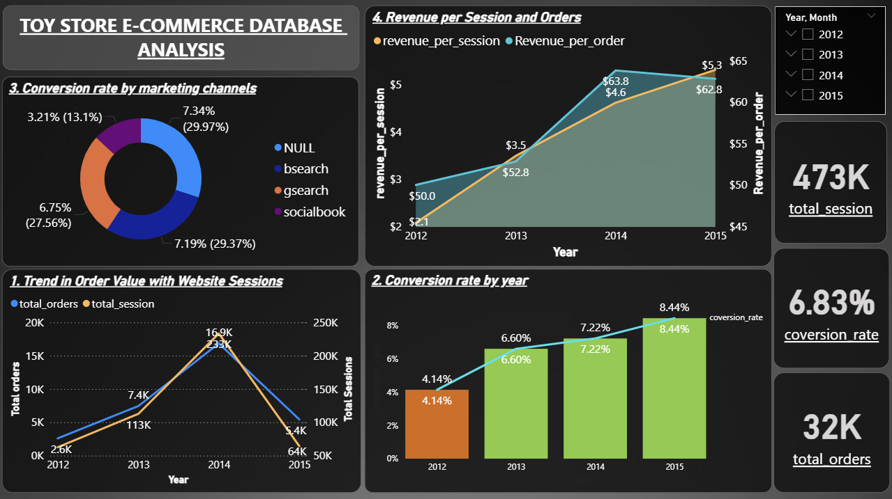

# Toy-Store-E-Commerce-Performance-Analysis
Objective:To analyze website sessions, order volume, conversion rate, and revenue performance.

 Dashboard Preview

Tools Used:Power BI

Key KPIs: Total Revenue
          Revenue per Session
          Conversion Rate
          Marketing Channel Performance
          
Insights:
Revenue growth was traffic-driven in early months.
Conversion efficiency improved after campaign optimization.
Paid Search delivered highest ROI.

Business Recommendation:
Focus on high-converting channels and optimize low-performing campaigns to improve revenue per session.
